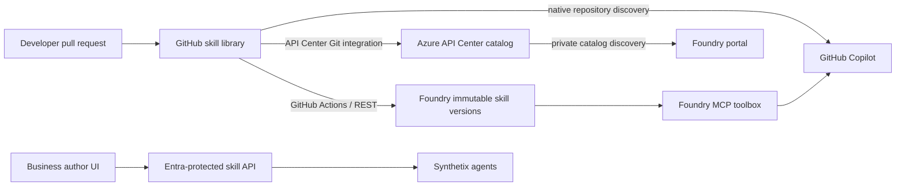

# Northstar Skill Library demo

This repository demonstrates one Git-authored skill library across GitHub Copilot, Azure API Center, Microsoft Foundry, and a Synthetix-facing API.

## Architecture



API Center is the discovery and governance catalog. Foundry stores executable, immutable skill versions and exposes them through MCP toolboxes. The included runtime enforces per-skill read, write, and run permissions for self-hosted consumers. These are complementary paths; API Center does not execute a skill or supply per-skill run authorization.

## Requirement coverage

| Requirement | Demo implementation |
| --- | --- |
| Standard, LLM-friendly interface | Agent Skills `SKILL.md`, Foundry MCP toolbox, and OpenAPI REST facade |
| Entra read/write/run | Container Apps Easy Auth plus per-skill app-role/group policy |
| Nontechnical maintenance | Browser editor with draft and publish actions |
| Version control | Git history plus immutable Foundry skill versions |
| Draft/published | Runtime lifecycle; only published skills can run |
| Author tracking | Entra identity in runtime history and Git commit history |
| Code bundled with a skill | `pii-redaction/scripts/redact.py` |
| Enable per user | Optional `enabledUsers` allowlist on each catalog record |
| Team/domain/global sharing | Tags and Entra groups; repository-level Copilot discovery |
| Automated colleague sync | Git pull for developers, API Center Git integration, and GitHub Actions to Foundry |

## Run locally

```powershell
$env:ASPNETCORE_ENVIRONMENT='Development'
dotnet run --project ./src/SkillLibrary.Api --urls http://127.0.0.1:5187
./scripts/Test-Local.ps1
```

Open `http://127.0.0.1:5187`. Local Development mode grants reader, author, and runner roles. Production requires a validated Easy Auth principal.

## Azure setup order

1. Sign in as `lverghote@MngEnvMCAP125495.onmicrosoft.com` and select subscription `07122d2f-74de-4565-bd61-4d673d621fe8`.
2. Initialize Git, create a remote repository, and push `main`.
3. Run `./scripts/Prepare-Entra.ps1`; assign its three app roles to the intended users or Entra groups.
4. Convert `$env:SKILL_LIBRARY_CLIENT_SECRET` to a secure string and run `Deploy-Azure.ps1` with the returned tenant and client IDs.
5. Follow [API Center setup](docs/API-CENTER-SETUP.md) for `API-center-skills`.
6. Run `Sync-Foundry.ps1 -ProjectName <project>` and `Publish-Toolbox.ps1 -ProjectName <project>`.
7. Add the published toolbox MCP endpoint to the coding tools that support remote MCP resources.

## Production notes

The browser editor stores demo changes on the container filesystem. For production, replace `SkillStore` with a pull-request workflow or durable database, require approval before publish, emit audit telemetry, and use managed identity or workload federation instead of a client secret. Foundry skills, toolbox skill discovery, and the API Center private catalog are public preview as of 2026-09-20 and have no production SLA.

See [demo script](docs/DEMO-SCRIPT.md) for the customer walkthrough and [API Center setup](docs/API-CENTER-SETUP.md) for the portal-only Git integration step.